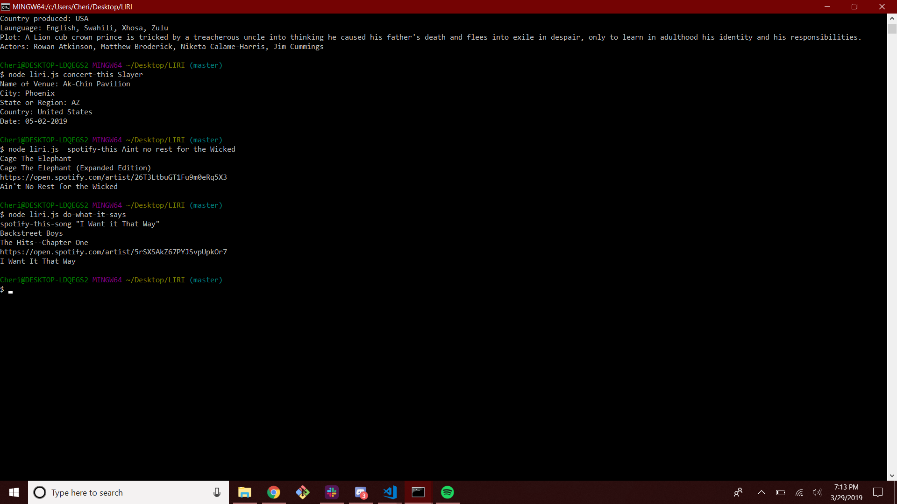

# LIRI
This application is designed to be relatively simple and fun to use.  The Application runs on node.js and several other nod packages such as, Moment(formatting), and node-spotify-api.  Axios and Spotify are used to obtain information for the application.  The application operates by putting I commands such as:

·         “movie-this” for Movies

·         “concert-this” for Bands

·         “Spotify-this’ for Song information

